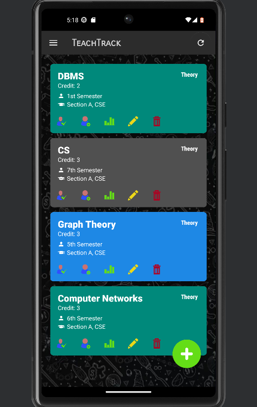
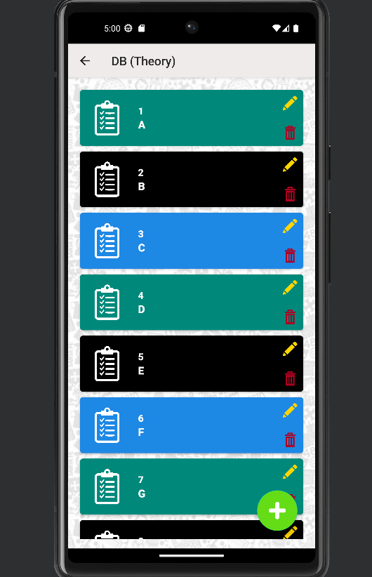
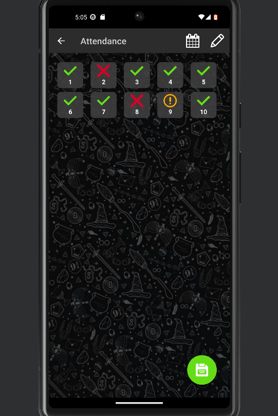
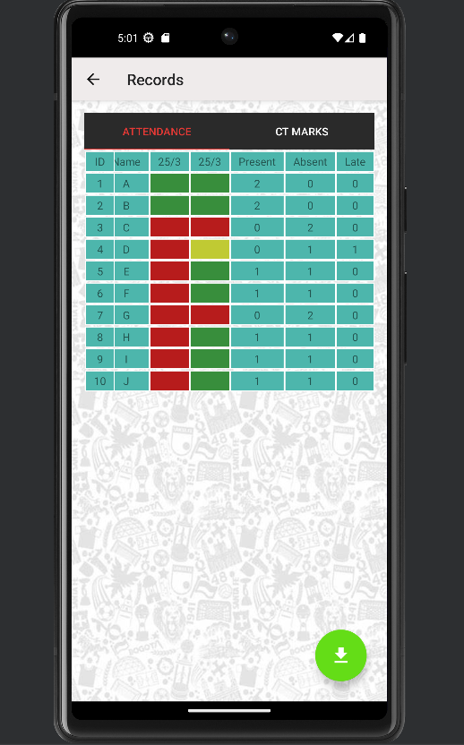

# TeachTrack – Student Management App 📚📱

## About TeachTrack
TeachTrack is a comprehensive **student management application** designed for educators to efficiently handle administrative tasks.  
Built using **Java** in the **Android Studio** environment, it simplifies attendance tracking, academic records, and course management — all in a clean, intuitive interface.

---

## ✨ Features

1. **Student Management**
   - Add, edit, and delete student records.
   - Bulk addition via **CSV files**.
2. **Attendance Tracking**
   - Mark attendance (Present/Absent/Late).
   - View attendance statistics and detailed reports.
3. **Academic Record Management**
   - Manage class test, lab, and sessional marks.
   - View individual student performance in theory and lab.
4. **Course Management**
   - Create, edit, and organize courses by department, section, and semester.
5. **Backup and Restore**
   - Export/import student and course data.
   - Support for **CSV** and **PDF** formats.
6. **Help and Support**
   - Built-in user guide for first-time users.
   - Email templates for contacting support.
7. **User-Friendly Interface**
   - Simple, modern, and mobile-optimized UI.

---

## 🖼️ Screenshots

| Home | Student List | Attendance | Records |
|------|--------------|------------|---------|
|  |  |  |  |

---

## ⚙️ Installation Guide

1. Clone the repository:
   ```bash
   git clone https://github.com/Khushi0389/TeachTrack
Open the project in Android Studio.

Build the project and run it on an emulator or physical device.

🧰 Technologies Used
IDE: Android Studio

Programming Language: Java

Database: SQLite

🤝 How to Contribute
Fork the repository.

Create a feature branch:
git checkout -b feature-name

Commit your changes:
git commit -m "Add feature description"

Push to your branch:
git push origin feature-name

Open a Pull Request and describe your changes.

📄 License
MIT License. Feel free to use and modify with proper attribution.

🙋‍♀️ Maintainer
Khushi Gupta
https://github.com/Khushi0389
